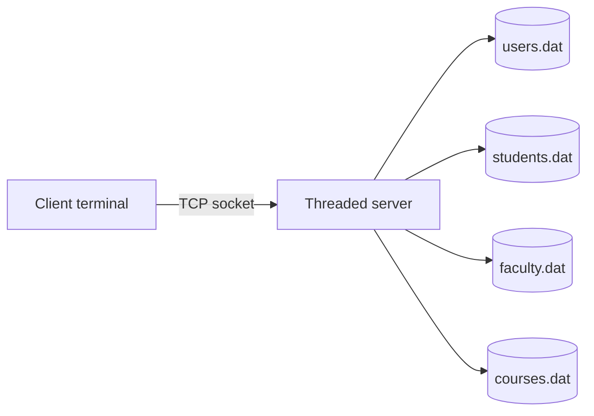

# OS Project: Multi-User Client/Server System


Course project in C that implements a threaded client/server application for managing users, students, faculty, courses, and enrollments.

The server listens on a TCP socket, handles each client in a separate thread, and persists application data to local binary files under `data/`.

## Overview

This project provides a terminal-based workflow for:

- Creating accounts for admin, faculty, and student roles
- Logging in through a simple socket client
- Managing course and enrollment records on the server
- Persisting application state in binary files for local coursework use

## Repository Structure

```text
.
├── client.c
├── server.c
├── makefile
├── README.md
├── .gitignore
├── .github/workflows/ci.yml
└── report.pdf
```

Generated build artifacts and runtime data are intentionally excluded from version control.

## Prerequisites

- A POSIX-like environment such as Linux, macOS, or WSL
- `gcc`
- `make`

> The project uses POSIX networking headers such as `<sys/socket.h>` and `<netinet/in.h>`, so it is not intended for the native Windows compiler toolchain.

## Build

```bash
make
```

This creates the binaries in `bin/`:

- `bin/server`
- `bin/client`

## Run

Start the server in one terminal:

```bash
make run-server
```

Start the client in a second terminal:

```bash
make run-client
```

By default, the client connects to `127.0.0.1:8080`.

## Default Credentials

The first launch creates a default administrator account if the user database is empty.

- Username: `admin`
- Password: `admin123`

## Runtime Data

When the server starts, it ensures the `data/` directory exists and creates the backing files used by the application:

- `data/users.dat`
- `data/students.dat`
- `data/faculty.dat`
- `data/courses.dat`

These files contain runtime state only. Deleting `data/` resets the application.

## Architecture



## Notes

- The project is designed for local execution and demonstration.
- `report.pdf` is preserved as the original coursework report.
- The GitHub Actions workflow in [.github/workflows/ci.yml](.github/workflows/ci.yml) provides a basic build check on push and pull request.

## Future Improvements

- Split shared socket and file utilities into separate source files
- Add automated tests for the text protocol and persistence layer
- Parameterize the host and port through command-line arguments
- Add screenshots or a short demo GIF for a stronger repository presentation
