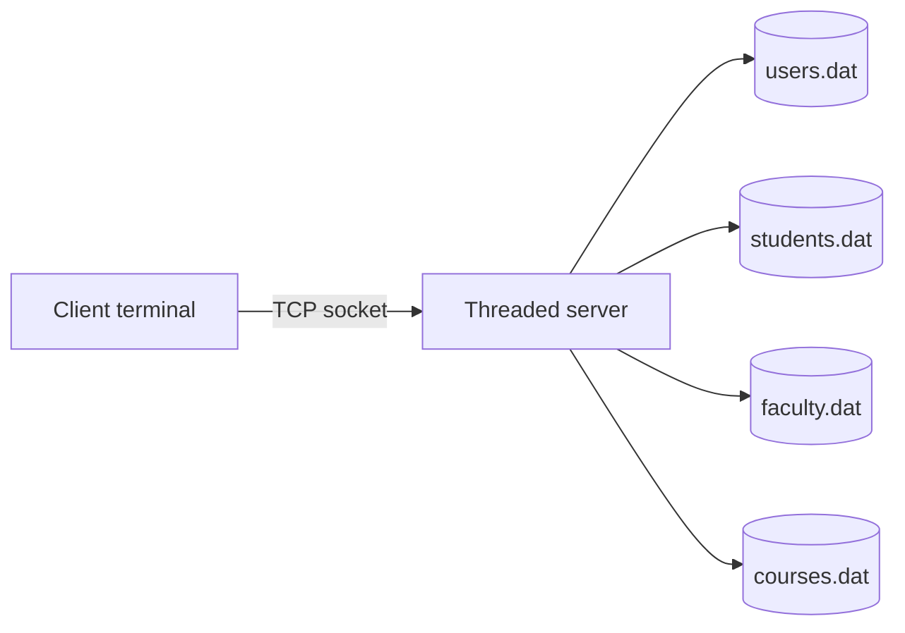

# OS Project: Multi-User Client/Server System

A course project written in C that implements a threaded client/server application for managing users, students, faculty, courses, and enrollments.

The server listens on a TCP socket, handles each client in a separate thread, and persists application data to local binary files under `data/`.

## Highlights

- Threaded TCP server built with POSIX sockets and `pthread`
- Role-based flows for admin, faculty, and student users
- Account creation and login over a simple terminal client
- File-backed persistence with automatic data directory bootstrapping
- Default admin account created on first run

## Repository Layout

```text
.
├── client.c
├── server.c
├── makefile
├── README.md
├── .gitignore
├── .github/workflows/ci.yml
└── report.pdf
```

Generated files such as build outputs and runtime data are ignored from version control.

## Requirements

- A POSIX-like environment such as Linux, macOS, or WSL
- `gcc`
- `make`

> The code uses headers such as `<sys/socket.h>` and `<netinet/in.h>`, so it is not intended to compile with the native Windows toolchain.

## Build

```bash
make
```

This produces the executables in `bin/`:

- `bin/server`
- `bin/client`

## Run

Open two terminals.

Start the server first:

```bash
make run-server
```

Then start the client in another terminal:

```bash
make run-client
```

By default the client connects to `127.0.0.1:8080`.

## Default Login

The server creates a default admin user the first time it starts if no users exist yet.

- Username: `admin`
- Password: `admin123`

## How It Works



## Data Files

The server automatically creates a `data/` directory and binary storage files on startup:

- `data/users.dat`
- `data/students.dat`
- `data/faculty.dat`
- `data/courses.dat`

These files are runtime state, not source code, so they stay out of git.

## Notes

- The protocol is text-driven and intended for local coursework use.
- Because the project stores records in binary files, deleting `data/` resets the application state.
- `report.pdf` is preserved as the original coursework report if you want to include it in the repository.

## Suggested Next Improvements

- Split the shared socket helpers into a reusable module
- Add automated tests for the message protocol and record persistence
- Add a small demo GIF or screenshots to the README
- Parameterize the server port and host through command-line arguments
"# os-project" 
